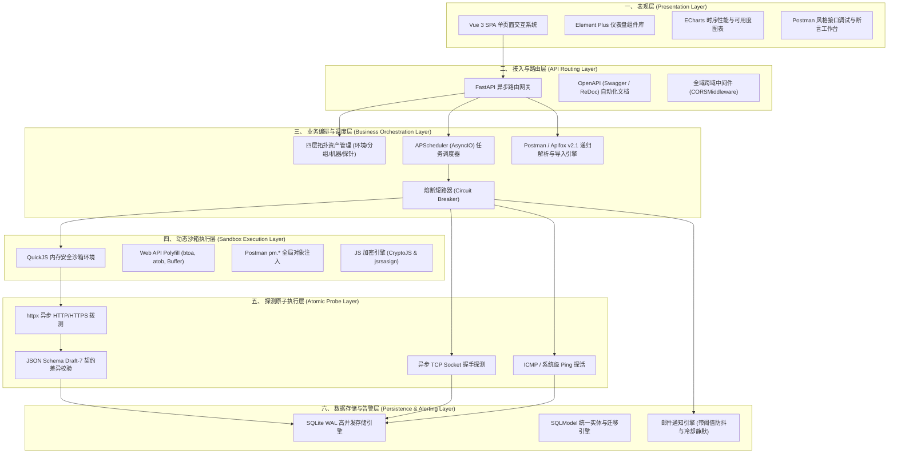
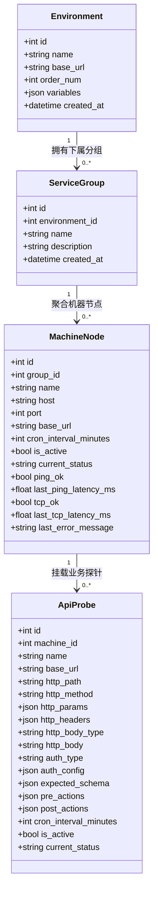
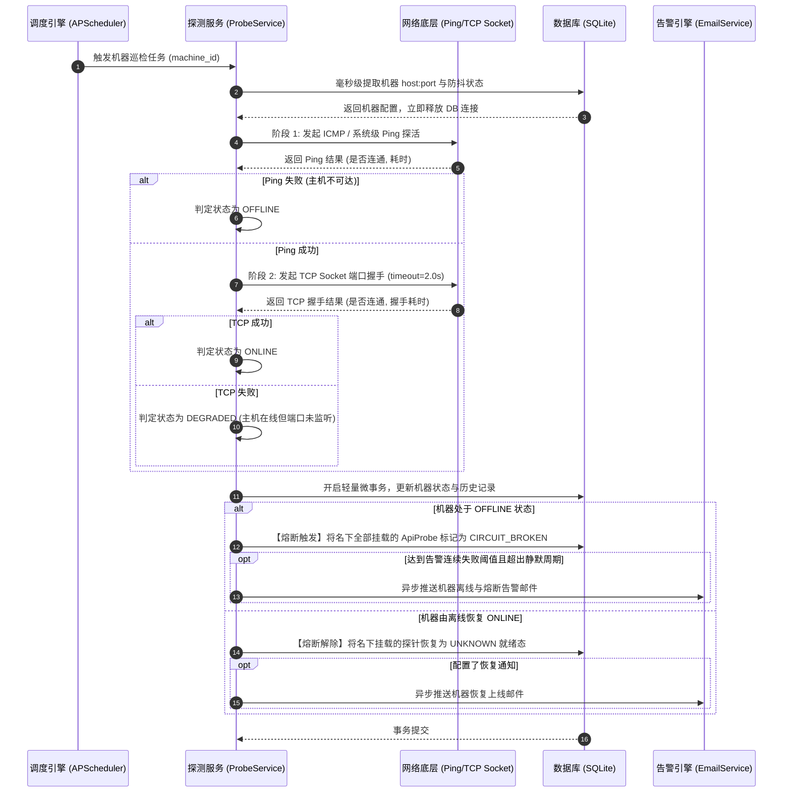
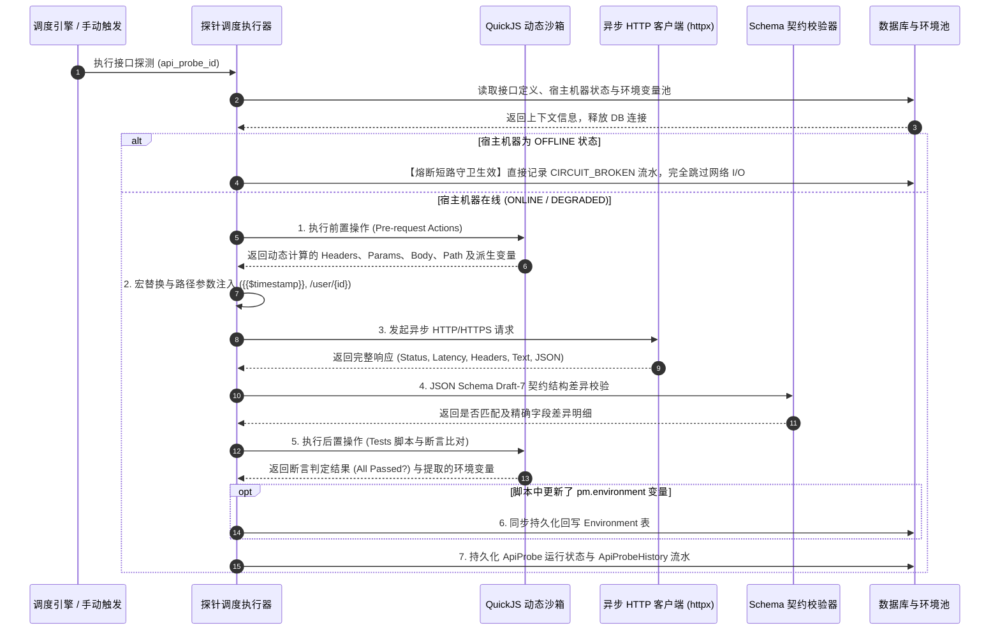
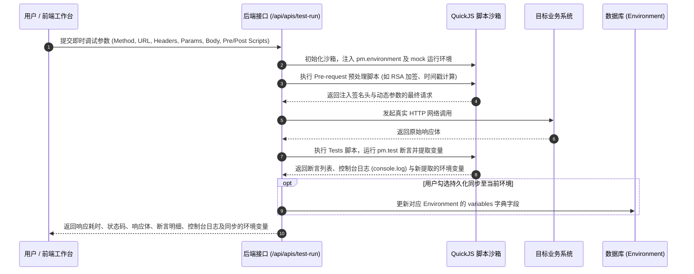

# SchemaPulse - 系统架构设计文档

> **版本**：v2.0.0  
> **状态**：正式交付  
> **更新时间**：2026年9月  

---

## 1. 系统总体分层架构

SchemaPulse 采用标准的前后端分离与分层解耦架构，自上而下划分为六个核心逻辑层：



---

## 2. 四层资产模型架构设计

为彻底消除“接口探测与机器状态割裂”的缺陷，系统设计了四层树状模型：



### 资产层级职责规范：
1. **环境层 (Environment)**：定义全局网络边界（如生产集群、测试沙箱），持有环境公用 `base_url` 与全局动态环境变量池（`variables`）；
2. **分组层 (ServiceGroup)**：业务系统与微服务集群划分（如订单中心、支付中台、用户中台）；
3. **机器层 (MachineNode)**：代表真实宿主机器/容器实例（指定 `host:port`）。**独立承载机器主机在活性（Ping）与服务端口连通性（TCP）探测**；
4. **探针层 (ApiProbe)**：挂载于宿主机器之上，继承或覆盖宿主网络地址，承载 HTTP/HTTPS 业务链路请求、前置脚本、动态签名、JSON Schema 契约巡检与后置断言。

---

## 3. 数据库实体与关系设计 (ERD)

系统数据库包含拓扑实体表与独立的历史流水表，通过外键索引与级联优化实现高吞吐：

```mermaid
erDiagram
    environments ||--o{ service_groups : "has"
    service_groups ||--o{ machine_nodes : "contains"
    machine_nodes ||--o{ api_probes : "mounts"
    machine_nodes ||--o{ machine_probe_histories : "logs"
    api_probes ||--o{ api_probe_histories : "logs"

    environments {
        int id PK
        string name UK
        string base_url
        int order_num
        json variables
        datetime created_at
    }

    service_groups {
        int id PK
        int environment_id FK
        string name
        string description
        datetime created_at
    }

    machine_nodes {
        int id PK
        int group_id FK
        string name
        string host
        int port
        string base_url
        int cron_interval_minutes
        bool is_active
        string current_status
        int consecutive_failures
        bool ping_ok
        float last_ping_latency_ms
        bool tcp_ok
        float last_tcp_latency_ms
        string last_error_message
        datetime last_probed_at
        datetime last_alert_at
    }

    api_probes {
        int id PK
        int machine_id FK
        string name
        string base_url
        string http_path
        string http_method
        json http_params
        json http_headers
        string http_body_type
        string http_body
        string auth_type
        json auth_config
        json expected_schema
        json pre_actions
        json post_actions
        int cron_interval_minutes
        bool is_active
        string current_status
        int consecutive_failures
        int last_http_code
        float last_http_latency_ms
        bool last_schema_matched
        datetime last_probed_at
        datetime last_alert_at
    }

    machine_probe_histories {
        int id PK
        int machine_id FK
        bool ping_ok
        float ping_latency_ms
        bool tcp_ok
        float tcp_latency_ms
        string error_message
        datetime probed_at
    }

    api_probe_histories {
        int id PK
        int api_probe_id FK
        int machine_id FK
        bool circuit_broken
        int http_status_code
        float http_latency_ms
        bool schema_matched
        json schema_diff_detail
        json assertions_result
        string raw_response_snippet
        bool is_healthy
        datetime probed_at
    }
```



---

## 4. 核心业务时序流程设计

### 4.1 机器节点探活与熔断处理时序



---

### 4.2 接口探测、脚本沙箱与契约校验时序



---

### 4.3 工作台接口即时测试与环境热同步时序



---

## 5. 关键子系统架构设计细节

### 5.1 探测调度引擎与生命周期管理

- **调度技术底座**：采用 `APScheduler` 的 `AsyncIOScheduler`，深度融入 FastAPI 的 `asyncio` 原生事件循环；
- **任务隔离机制**：机器探活（`scheduled_machine_job`）与接口业务探测（`scheduled_api_job`）采用独立 Job ID 注册：
  - 机器任务 ID：`probe_machine_{machine_id}`
  - 接口任务 ID：`probe_api_{api_id}`
- **动态周期调节与热重载**：
  - 支持 `1` 分钟至 `43200` 分钟（最长 30 天）的任意自定义周期；
  - 支持将 `cron_interval_minutes` 设为 `0` 或将 `is_active` 置为 `false`，调度器将毫秒级从内存队列中注销该任务，转为“仅手动/被动探测”模式；
  - 接口配置变更时，无需重启系统，调度器自动热替换（`replace_existing=True`）并立即排队触发首次校准探活。

---

### 5.2 降噪与告警防抖算法

为了杜绝偶发网络抖动造成运维告警轰炸，系统内置了双层防抖过滤算法：

$$\text{Trigger Alert} = \left( \text{consecutive\_failures} \ge \text{retry\_threshold} \right) \land \left( \text{now} - \text{last\_alert\_at} \ge \text{silence\_minutes} \right)$$

1. **连续失败阈值（Retry Threshold）**：
   - 默认设置为连续失败 3 次才触发报警状态；
   - 1 次或 2 次偶发超时仅标记为 `DEGRADED`（降级黄色状态），不发送邮件；
2. **冷却静默周期（Silence Minutes）**：
   - 首次报警触发后，记录 `last_alert_at`；
   - 在静默窗口期内（默认 30 分钟），系统持续记录故障历史流水，但抑制邮件投递；
3. **故障恢复通知（Auto-Recovery Notification）**：
   - 当节点或接口从 `DOWN` / `OFFLINE` 状态恢复为正常时，立即发送绿色恢复通知邮件，形成完整闭环。

---

### 5.3 数据库防死锁与短事务架构

由于 SQLite 为单进程文件型数据库，在多协程高频探活场景下，设计了强健的短事务保护策略：

```
[协程生命周期]
  │
  ├─ 1. 开启 Session -> 读取目标配置与阈值 -> 立即 Commit/Close 会话 (耗时 < 1ms)
  │
  ├─ 2. 执行网络 I/O (Ping / TCP握手 / HTTP请求 / JS沙箱计算) -> 完全脱离 DB 会话 (耗时 10ms ~ 5000ms)
  │
  └─ 3. 开启 Session -> 写入状态与 History 流水 -> 立即 Commit/Close 会话 (耗时 < 2ms)
```

通过将网络阻塞操作完全隔离在数据库会话之外，使得数据库并发连接占用率降至极低，彻底杜绝了 `database is locked` 现象。

---

## 6. 系统部署架构与演进路线

### 6.1 当前生产部署形态（轻量自包含架构）

适用于中小企业、私有化部署及边缘网关环境：

```
[单宿主机 / 容器 / 虚拟机]
  │
  ├─ [前端服务 (端口: 3000)] : 托管 SPA 静态资产
  │     └── 入口: python frontend/run.py
  │
  ├─ [后端 API 服务 (端口: 8000)] : FastAPI + APScheduler
  │     └── 入口: python backend/run.py
  │
  ├─ [本地存储] : backend/monitor.db (SQLite WAL 模式)
  │
  └─ [进程守卫] : python start_all.py
```

### 6.2 分布式高可用演进架构规划

当被监控机器节点超过 5,000 台、接口探针超过 50,000 个时，系统可无缝平滑演进为分布式微服务集群：

```
                 [Nginx / SLB 负载均衡]
                            │
            ┌───────────────┴───────────────┐
            ▼                               ▼
    [API 节点 1 (FastAPI)]         [API 节点 2 (FastAPI)]
            │                               │
            └───────────────┬───────────────┘
                            │
           [Redis Cluster 任务队列与分布式锁]
                            │
            ┌───────────────┴───────────────┐
            ▼                               ▼
    [Probe Worker 探针节点 1]      [Probe Worker 探针节点 2]
    (Ping / TCP / QuickJS / HTTP)  (Ping / TCP / QuickJS / HTTP)
            │                               │
            └───────────────┬───────────────┘
                            │
               [PostgreSQL / MySQL 集群]
                            │
               [ClickHouse 时序历史大盘]
```

1. **持久层平滑迁移**：由于核心 ORM 使用了跨数据库的 `SQLModel`，仅需修改 `DATABASE_URL` 环境变量即可从 SQLite 平滑切换至 PostgreSQL 或 MySQL；
2. **任务分发解耦**：调度引擎由单机内存调度替换为 Redis Distributed Stream / Celery，各探测 Worker 节点无状态水平扩容；
3. **海量时序存储**：历史探测记录可按月归档至 ClickHouse，实现亿级历史流水秒级分析。
